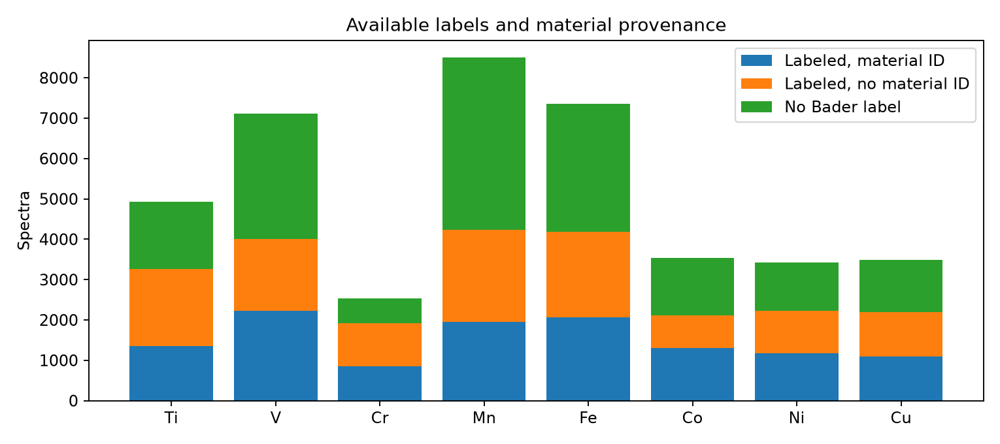
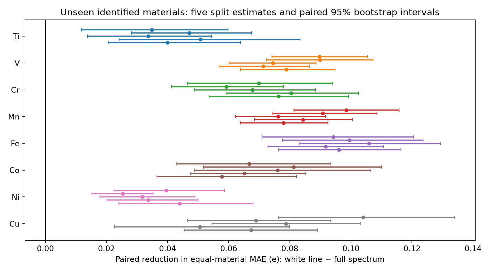
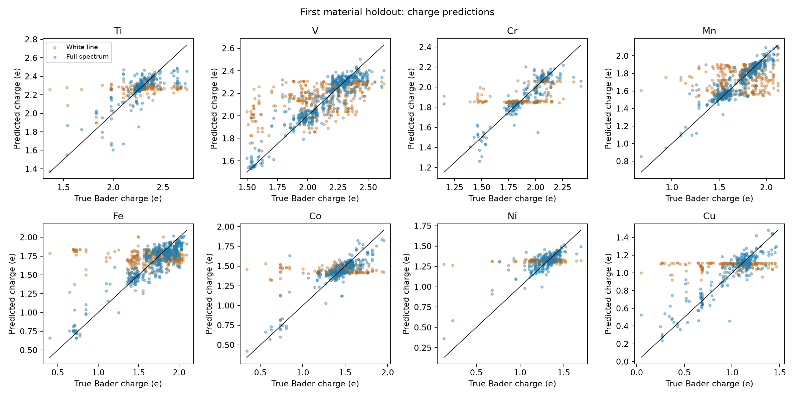
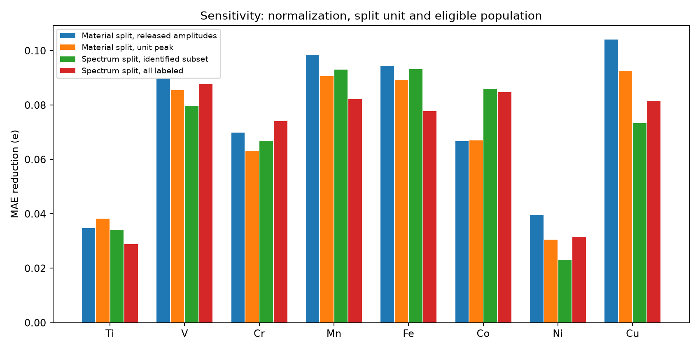

# Charge information beyond white-line position: independent analysis

Full spectra contain reproducible predictive information about computed Bader charge beyond the released-grid white-line position for all eight elements in the identified-material subset. Across five independently randomized material holdouts, the mean reduction in equal-material MAE is **0.0348–0.0975 electron-charge units**, or **31.0–56.7%** relative to a validation-selected white-line-only predictor. All 40 primary paired, material-bootstrap 95% intervals are above zero. This supports an incremental prediction claim for this processed, labeled population; it does not measure information in bits, establish a causal charge signature, or demonstrate performance on experimental spectra.

The evidence is weaker for a restricted linear model: Ni has no clear incremental gain in any of the five ridge-only comparisons, with one negative point estimate. There are also inconclusive ridge comparisons for Ti, Co and Cu. No primary comparison using the prespecified flexible model selection fails to show a gain; I do not manufacture an unsupported null result for an element.

**Population and provenance.** There are 40,907 released spectra, 24,133 with Bader labels, of which 12,016 have material IDs. Identified labeled records represent 7,541 element-specific material groups; that sum is not a claim about globally unique materials across elements. All identified records have `origin=scrape`; all `origin=feff` records lack material IDs. Thus provenance completeness and origin are confounded. The primary claim conditions on the scraped, labeled, identified subset. Missing labels are never imputed.

| Element | All spectra | Bader labeled | Labeled with ID | Identified materials | Labeled without ID |
| --- | --- | --- | --- | --- | --- |
| Ti | 4930 | 3267 | 1354 | 705 | 1913 |
| V | 7120 | 4001 | 2228 | 1305 | 1773 |
| Cr | 2542 | 1921 | 844 | 626 | 1077 |
| Mn | 8504 | 4226 | 1955 | 1271 | 2271 |
| Fe | 7362 | 4188 | 2059 | 1271 | 2129 |
| Co | 3533 | 2106 | 1310 | 835 | 796 |
| Ni | 3420 | 2226 | 1179 | 757 | 1047 |
| Cu | 3496 | 2198 | 1087 | 771 | 1111 |

All eight elements have finite absorption and energy values on a common, increasing 100-point energy grid within the element. No exact duplicate absorption arrays were found within an element. Grid spacing is about 0.53 eV. No additional spectral-quality exclusions were needed. Missing Bader labels, and unidentified records in the material study, are declared `excluded`. Coordination and neighbor-distance labels were not used as predictors or selection filters.

**Design and predictor choices.** The target is the supplied Bader charge, not formal oxidation state. Each element is modeled separately. The white-line feature is exactly the photon energy at maximum absorption; ties select the first maximum. The full predictor contains all 100 released absorption values plus this deterministic white-line feature. Appending it ensures that the full predictor has explicit access to every feature supplied to the baseline and makes the comparison about information beyond this position. Absolute energy axes are preserved; spectra are not peak-aligned, smoothed, resampled or charge-shifted. No provenance or other label enters either predictor.

The primary treatment retains the released amplitudes because their physical normalization before release is unknown. The inputs are already processed, and no raw-spectrum reconstruction is claimed. A sensitivity divides each spectrum by its maximum absolute absorption. This is a per-record transformation without population fitting and keeps its white-line unchanged.

For each element and each seed (`1729`, `2718`, `31415`, `57721`, `81173`), unique identified material IDs are shuffled and assigned approximately 60%/20%/20% to training/validation/test. The 20% test and validation counts are rounded up. All eligible spectra of one material stay in the same partition. Unknown-ID spectra are entirely excluded from this assessment: treating them as single-record materials would leave hidden overlap unresolved. Conditions in each `comparison_id` use exactly the same inclusion and partition assignments.

Each condition independently selects among six candidates by validation MAE: standardized ridge regression (alpha 1 or 100), standardized-target RBF SVR (C=10, epsilon=0.05, gamma `scale` or 0.1/feature-count after input standardization), and ExtraTrees (100 trees, minimum leaf size 2 or 8, all features available at each split). StandardScaler and target scaling are fitted only on training data. This deliberately offers linear, smooth nonlinear and tree models to both feature sets; a linear white-line baseline alone could confound extra information with misspecified response shape. The grid is modest and not an exhaustive search for an optimal predictor. Models are fitted with equal spectrum weight, while grouped validation gives each material equal total weight. The selected training fit predicts test data without validation refitting. Test error never chooses a candidate or preprocessing variant.

The primary estimand is the mean, over held-out materials, of each material's mean absolute prediction error; this prevents heavily represented materials from dominating the scientific comparison. Positive delta means white-line MAE minus full-spectrum MAE. The following averages are descriptive means over five overlapping random holdouts, not five independent experiments. Their ranges describe partition sensitivity and are not confidence intervals. Units are electron-charge units throughout.

| Element | White-line MAE | Full MAE | MAE reduction | Relative reduction | Range over five splits |
| --- | --- | --- | --- | --- | --- |
| Ti | 0.1330 | 0.0917 | 0.0413 | 31.0% | 0.0337–0.0508 |
| V | 0.1591 | 0.0782 | 0.0808 | 50.8% | 0.0713–0.0899 |
| Cr | 0.1423 | 0.0715 | 0.0707 | 49.7% | 0.0592–0.0805 |
| Mn | 0.1508 | 0.0653 | 0.0856 | 56.7% | 0.0762–0.0985 |
| Fe | 0.2019 | 0.1044 | 0.0975 | 48.3% | 0.0917–0.1059 |
| Co | 0.1526 | 0.0832 | 0.0694 | 45.5% | 0.0578–0.0812 |
| Ni | 0.1027 | 0.0678 | 0.0348 | 33.9% | 0.0253–0.0439 |
| Cu | 0.1622 | 0.0883 | 0.0739 | 45.6% | 0.0506–0.1041 |

**Uncertainty.** Each split uses 4,000 paired bootstrap resamples of held-out material IDs. All spectra from a resampled material contribute through that material's mean loss. The same resampled units compare the two conditions. This is conditional test-population uncertainty with fitted models held fixed; it does not include retraining, validation-selection, simulation or measurement uncertainty. Repeated partitions separately probe some fitting/partition instability. The repeats reuse materials and must not be pooled as independent observations.

The first split was fixed by the seed list before fitting. As an additional multiplicity sensitivity, its eight element intervals use 20,000 bootstrap resamples and 99.375% percentile coverage (Bonferroni alpha=0.05/8). These approximate, conditional intervals remain positive for every element; Ti is closest to zero. Their simultaneous interpretation depends on bootstrap adequacy and does not cover all exploratory sensitivities or all 40 overlapping intervals. Bootstrap fractions are recorded as descriptive quantities, not permutation-test p-values.

| Element | Test materials | First-split reduction | Paired 95% interval | Bonferroni 99.375% interval |
| --- | --- | --- | --- | --- |
| Ti | 141 | 0.0348 | [0.0117, 0.0598] | [0.0040, 0.0697] |
| V | 261 | 0.0897 | [0.0741, 0.1055] | [0.0685, 0.1118] |
| Cr | 126 | 0.0699 | [0.0465, 0.0941] | [0.0390, 0.1042] |
| Mn | 255 | 0.0985 | [0.0814, 0.1157] | [0.0762, 0.1231] |
| Fe | 255 | 0.0943 | [0.0709, 0.1206] | [0.0612, 0.1327] |
| Co | 167 | 0.0668 | [0.0430, 0.0934] | [0.0348, 0.1055] |
| Ni | 152 | 0.0396 | [0.0225, 0.0586] | [0.0175, 0.0689] |
| Cu | 155 | 0.1041 | [0.0763, 0.1340] | [0.0650, 0.1463] |

The audit-required `metrics.csv` reports ordinary **spectrum-weighted** MAE and R² for each run; the material-weighted primary estimand is stored separately in `comparisons.csv`. This distinction is intentional. Mean test spectrum R² across the five material splits is:

| Element | White-line R² | Full-spectrum R² |
| --- | --- | --- |
| Ti | 0.068 | 0.554 |
| V | 0.302 | 0.833 |
| Cr | 0.203 | 0.716 |
| Mn | 0.119 | 0.792 |
| Fe | 0.009 | 0.765 |
| Co | -0.015 | 0.770 |
| Ni | 0.005 | 0.611 |
| Cu | -0.015 | 0.685 |

White-line R² can be near zero or negative, especially for Fe, Co, Ni and Cu, while full-spectrum R² is much higher. Negative R² means worse squared error than the held-out target mean benchmark; selection itself was based on MAE. These averages should not be read as a single pooled R².

**Sensitivity and unsupported improvements.** Removing overall amplitude leaves positive full-spectrum gains, with 95% material-bootstrap intervals above zero for every element in the fixed first split. The first-split changes and two spectrum-level checks are below. Material studies average over materials; spectrum studies average over records, so columns with different split units are descriptive comparisons rather than matched effect differences.

| Element | Released amplitudes, material split | Unit-peak amplitudes, material split | Spectrum split, identified only | Spectrum split, all labeled |
| --- | --- | --- | --- | --- |
| Ti | 0.0348 | 0.0382 | 0.0341 | 0.0289 |
| V | 0.0897 | 0.0855 | 0.0797 | 0.0877 |
| Cr | 0.0699 | 0.0632 | 0.0668 | 0.0742 |
| Mn | 0.0985 | 0.0907 | 0.0930 | 0.0821 |
| Fe | 0.0943 | 0.0892 | 0.0932 | 0.0778 |
| Co | 0.0668 | 0.0670 | 0.0860 | 0.0847 |
| Ni | 0.0396 | 0.0306 | 0.0231 | 0.0316 |
| Cu | 0.1041 | 0.0925 | 0.0734 | 0.0814 |

The normalization result supports charge-related shape information beyond white-line position; it does not imply that absolute intensities carry no useful information. It also does not establish robustness to energy calibration errors, different broadenings, experimental noise or a different computational pipeline, none of which these inputs can directly validate.

For model-family sensitivity, the member of each family is separately selected on validation data and evaluated on the same test partition. `family_sensitivity.csv` records paired material-bootstrap intervals (1,000 resamples per family comparison). The mean reduction for Ni is only 0.0038 e with ridge, versus 0.0353 e with SVR and 0.0274 e with ExtraTrees. All five Ni ridge intervals contain zero. For example, seed 2718 gives **−0.0029 e [−0.0115, 0.0059]**: these data do not support improvement for that fitted linear procedure. Ti ridge at seed 1729 gives **0.0145 e [−0.0086, 0.0379]**, and three Co ridge splits and one Cu ridge split are also inconclusive. This is absence of convincing evidence for those restricted models, not evidence that the full spectrum contains no additional information. Both nonlinear families have positive lower 95% bounds for every primary element/split comparison.

**What the unidentified collection permits.** The `spectrum_identified` sensitivity splits rows of the same identified subset and exposes optimistic material reuse. In those test partitions, 39.6–64.2% of identified test spectra belong to an ID also present in training or validation (`spectrum_overlap.csv`). This explains why a random-row split cannot itself establish unseen-material performance. Its MAEs are often lower than the grouped split, but the precise difference also reflects changed test composition and weighting.

The `spectrum_all` sensitivity includes all labeled records, with unseen rows held out at random; it finds full-spectrum improvements for all eight elements. Its record bootstrap deliberately supports only a spectrum-level, conditional comparison. Because the unidentified FEFF records may share materials with each other or the scraped records, their true dependence and train/test material overlap cannot be audited. The nominal spectrum-level intervals can be too narrow under such hidden dependence. No unseen-material claim extends to the unidentified half of the labeled collection. Origin confounding also prevents attributing differences between the two cohorts solely to provenance completeness.

Exact duplicate absence does not rule out near duplicates, related structures, shared compositions or computational ancestry. Grouping the available material ID tests unseen IDs, not unseen chemical families, prototypes, synthesis routes or an external experimental distribution. Missing labels may be selective. Charge and spectral differences can also be associated with structure and coordination; those correlations are predictive information here but are not isolated causal effects. The finite model grid provides evidence of recoverable predictive signal, not the best possible error or a model-independent lower bound on conditional mutual information.

**Reproduction and audit.** `code/analyze.py` reproduces every split, candidate fit, required artifact and figure from the eight inputs. `code/audit_and_summarize.py` independently recomputes test metrics from source labels, checks all partition/prediction invariants and material-ID isolation, and produces the multiplicity sensitivity. `code/write_report.py` renders this report from the computed tables. `commands.md` records commands and task-specific information access; `design.json` records seeds, selected models, exact software versions and input hashes. Candidate validation scores are in `model_selection.csv`; first-split and all other detailed predictions with truth and provenance are in `diagnostics/` for interpretation, never used as predictors.

The final audit passes **128 runs, 64 paired comparisons, 43,576 predictions and 654,512 partition records**. Every run accounts for every source row of its element, and every declared test row has exactly one prediction. Every material run has disjoint identified materials in training, validation and test. All required per-run MAE and R² values reproduce from predictions. No repository, article, reference analysis or external task-specific material was accessed during this independent attempt.
